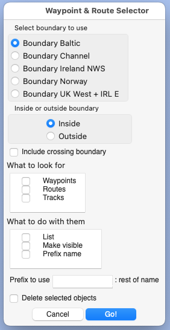

= Boundaries Utility

https://github.com/antipole2/JavaScripts-shared/blob/main/Boundaries/boundary.js[boundary.js]

This utility allows the selection and manipulation of waypoints, routes and tracks according to whether they are inside a chosen boundary.

You create one or more boundaries using pseudo-routes in OpenCPN.  A boundary must include the text 'boundary' in its name (case insensitive) and must share its first and last points.  If you have several boundaries, they may share routepoint borders.

The script searches for boundaries and displays a dialogue, such as this example:

(1) You select which boundary you wish to use and whether you want to select objects inside or outside it.

(2) For tracks and routes, you have the option of selecting ones that cross the boundary having points both inside and out.

(3) You select which objects you wish to select

(4) You specify what you want done with objects selected.

_List_  lists their names in the script output pane.

_Make visible_ makes the objects visible and makes all objects not selected invisible.

_Prefix name_ adds a prefix (e.g. +UK-S:+ to the selected objects name and removes any matching prefix from unselected objects.

_Delete_ deletes the selected objects.

.Restrictions
[NOTE]
===========
Changing the visibility of a route is only available in OpenCPN 5.8 and later.

It is not presently possible to change the visibility of a track because of limitations in the plugin API.
===========
.Time limits
[NOTE]
===========
If you have a large number of waypoints/routepoints, the script could take significant time to run.
The script sets a fresh time limit for each phase of its work, depending on the number of points you have.  This amount is set with the _timePerPoint_ variable near the start of the script.
The most time-consuming bit is updating visibility or names within OpenCPN and the script only performs these updates on an as-needed basis.  So if the script does run out of time, you can probably repeat the operation without increasing the limit and it will continue from where it got to before.
===========

== Off-loading objects

This utility ca be used to off-load objects for particular areas such as a cruising ground you are not visiting at present.  The objects are exported into a .gpx file and can then be deleted from OpenCPN.  If you return to the area, the objects can be imported back into OpenCPN.

[TIP]
==========
Before unloading ojects, I strongly recommend running the https://github.com/antipole2/JavaScripts-shared/blob/main/Housekeeper/Housekeeper.adoc[Housekeeper script] to resolve any issues with your objects, such as multiple points at the same location.
==========

=== Saving the objects to a .gpx file
To export the objects using the Route & Mark Manager, you first need to make them visible and all other objects invisible.

==== Making tracks visible
As it is not possible at present for the script to change track visibility, you need instead to add a prefix to the track name.
In the tracks tab of the Route & Mark Manager you can then use the filter to show just those tracks.
Then select _Show all tracks_.  This makes these tracks visible and others invisible.

With all the desired waypoints, routes and tracks visible and no others visible, you can use _Export All Visible..._ to save to a single .gpx file.

=== Deleting the objects
You can now run the script again with the same boundary and the _Delete_ action selected.
The script deletes routes before waypoints and checks that the waypoints to be deleted are not still used by any remaining routes.  If they are still in use, they are not deleted and the routes are listed. 

[CAUTION]
========
While I believe this utility functions as described, it is up to you to make any necessary backups of .xml object files so you can recover from untoward results.
========
