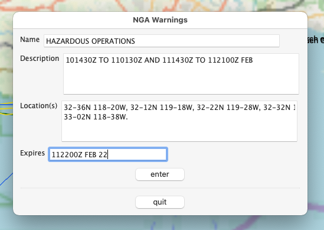

= NGA Warnings Utility (USA version)

https://github.com/antipole2/JavaScripts-shared/blob/main/NGAutility/NGA.js[NGAutility.js]

This script facilitates creating objects in OpenCPN to record navigational warnings.
This version is for those from the USA Coast Guard Navigation Centre, which issues NGAs.

.The warnings are in free text form, e.g.:
----
050613Z FEB 22
NAVAREA XII 68/22(18).
EASTERN NORTH PACIFIC.
CALIFORNIA.
1. HAZARDOUS OPERATIONS 101430Z TO 110130Z AND
111430Z TO 112100Z FEB IN  AREA BOUND BY
32-36N 118-20W, 32-12N 119-18W,
32-22N 119-28W, 32-32N 119-18W,
33-02N 118-38W.
2. CANCEL THIS MSG 112200Z FEB 22.
----
The script presents a form in which the relevant parts of this can be entered.
For the above this could be

On selecting `enter` the script checks that the position coordinates are in the correct format and that the expiry date, if any, is in the NGA format.
It then creates an object in OpenCPN.

If only one position is provided, it creates a waypoint and incorporates the description and expiry date in the description field.

If more than one position is provided, it creates a closed route with the positions as routepoints.
The plugin is unable to access the description field, so it stashes the description in the _From_ attribute and the expiry in the _To_ field.

In both cases, the name is prefixed with the tag NGA:

=== Expiries

When the script starts up, it first checks for previously created tagged objects and examines their expiry date.

If they have expired, it presents the option to delete them.
